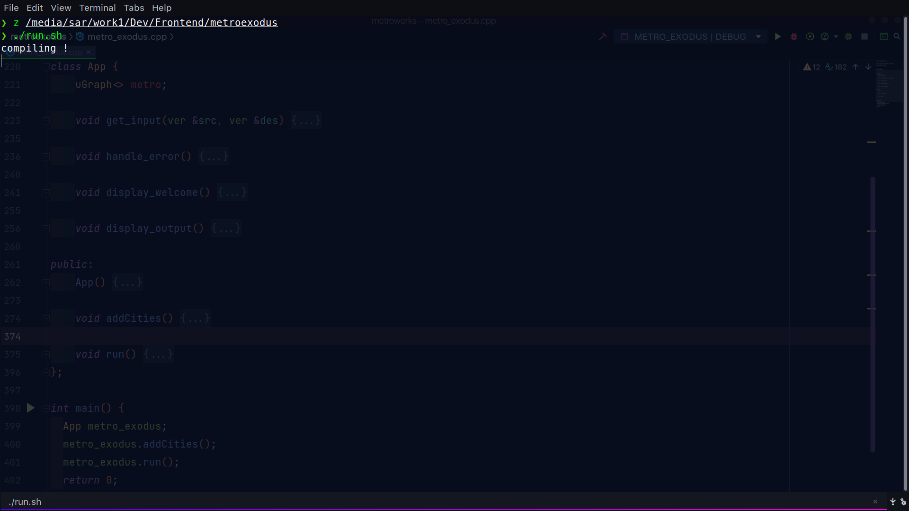
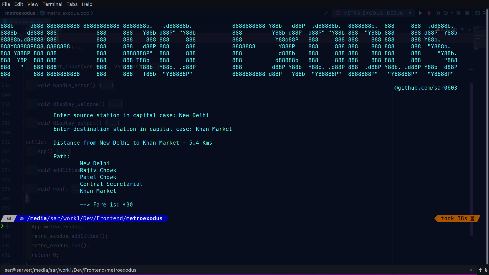
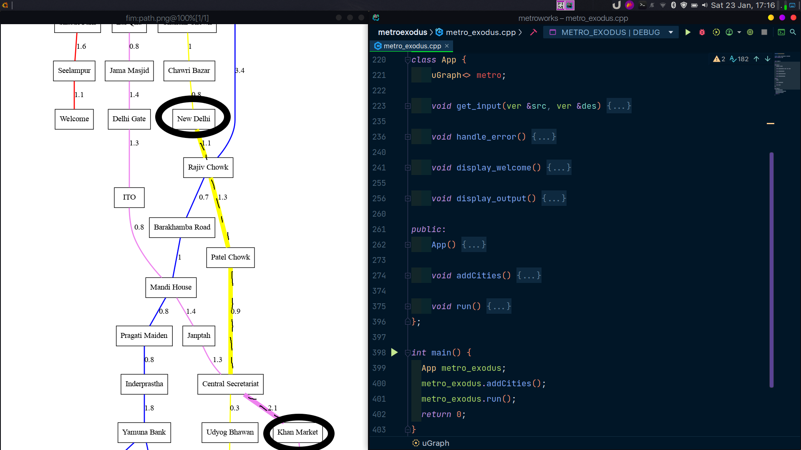

<p align="center">
  
</p>

                  

## :ledger: Index

- [About](#beginner-about)
- [Usage](#zap-usage)
  - [Installation](#electric_plug-installation)
  - [Tools](#package-tools)
  - [Commands](#electric_plug-commands)
- [File Structure](#file_folder-file-structure)
- [Resources](#page_facing_up-resources)
- [Gallery](#camera-gallery)
- [Credit/Acknowledgment](#star2-creditacknowledgment)
- [License](#lock-license)

## :beginner: About

Named after one of my favorite videogames 😄 . 
**Metroexodus** is a linux **CLI** app that helps you find & visualize the Shortest Path between Delhi Metro Stations and calculate appropriate **fares**, it uses Graph Data Structure & **Dijkstra**'s Algorithm and vizualized by help of **graphviz**

## :zap: Usage

To use this project.

### :electric_plug: Installation

- Install dependencies & export environment variables.

```bash
git clone https://github.com/sar0603/metroexodus
cd metroexodus
chmod +x ./install.sh
./install.sh #installs dependencies 
```

### :package: Tools

- [graphviz](http://www.graphviz.org/)
- [fim](http://manpages.ubuntu.com/manpages/xenial/man1/fim.1.html)
- [zenity](https://packages.ubuntu.com/trusty/gnome/zenity)
- [sl](http://manpages.ubuntu.com/manpages/trusty/man6/sl.6.html)
- [notify-send](http://manpages.ubuntu.com/manpages/xenial/man1/notify-send.1.html)

### :electric_plug: Commands

- Start project using

```bash
$ ./run.sh
```

## :file_folder: File Structure

- Add a file structure here with the basic details about files, below is an example.

```
.
├── _config.yml
├── data.txt
├── fare.csv
├── Fare data
│   └── Fare Matrix Delhi Metro.xlsx
├── finalmap.dot
├── graph.png
├── graphvizdotfiles
│   ├── graph.png
│   ├── MyGraph
│   ├── path.png
│   └── StationId
├── LICENSE
├── maps
│   ├── Delhi Metro System Map.svg
│   ├── graph.svg
│   ├── id.svg
│   └── this graph test signature shape from graphviz.svg
├── metroexodus.cpp
├── path.png
├── README.md
├── stations.txt
├── train1.png
└── train.png

3 directories, 22 files
```

## :page_facing_up: Resources

- [DMRC](http://www.delhimetrorail.com/)

## :camera: Gallery

<p align="center">
  
</p>

<p align="center">
  
</p>

<p align="center">
  
</p>

### Current Delhi Metro Stations (In our Program)

<p align="center">
  
</p>

## :lock: License

[](https://github.com/sar0603/metroexodus/blob/master/LICENSE)
